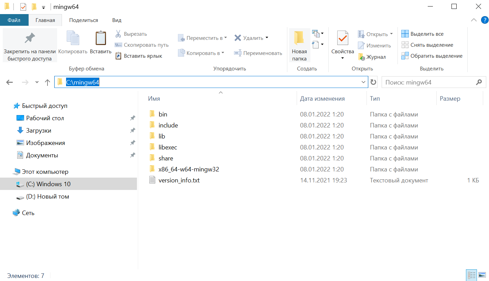
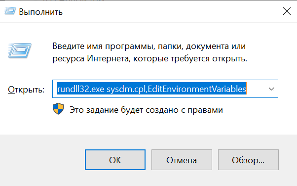
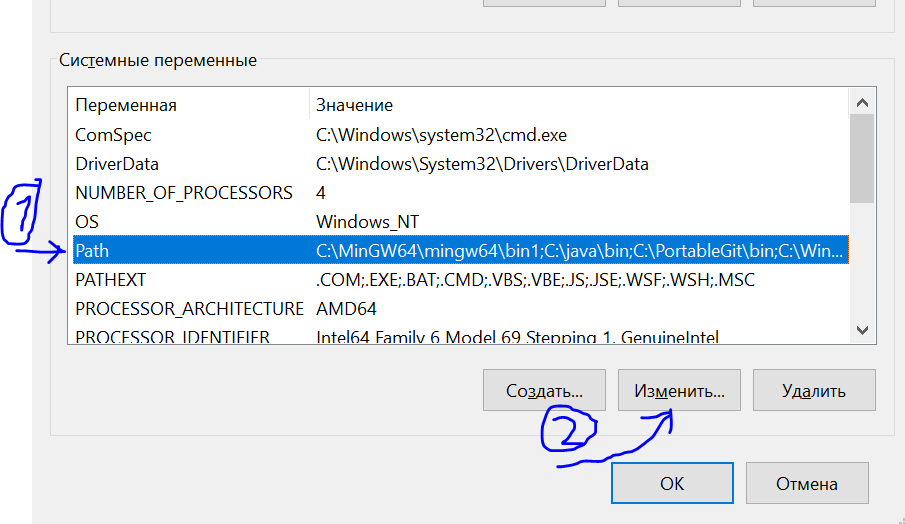
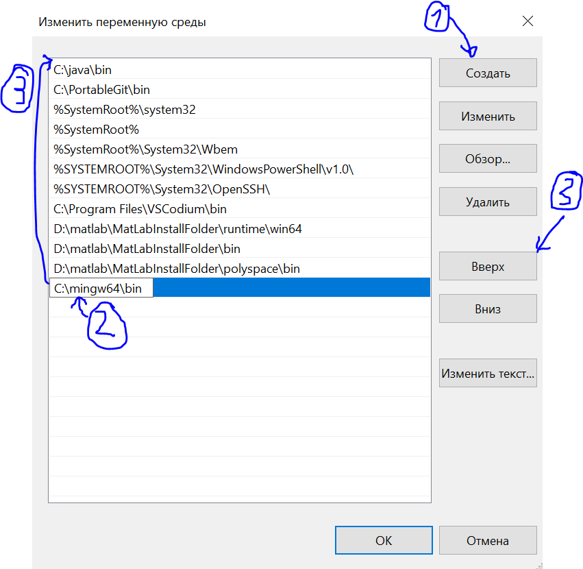
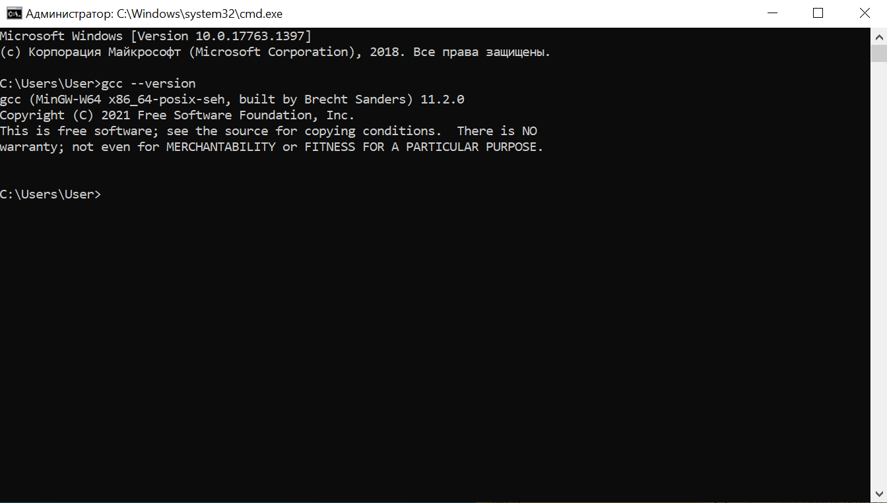
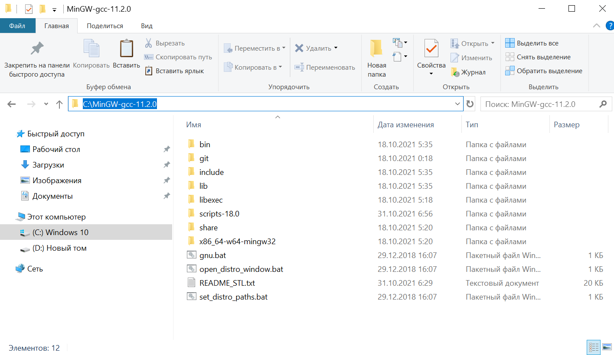
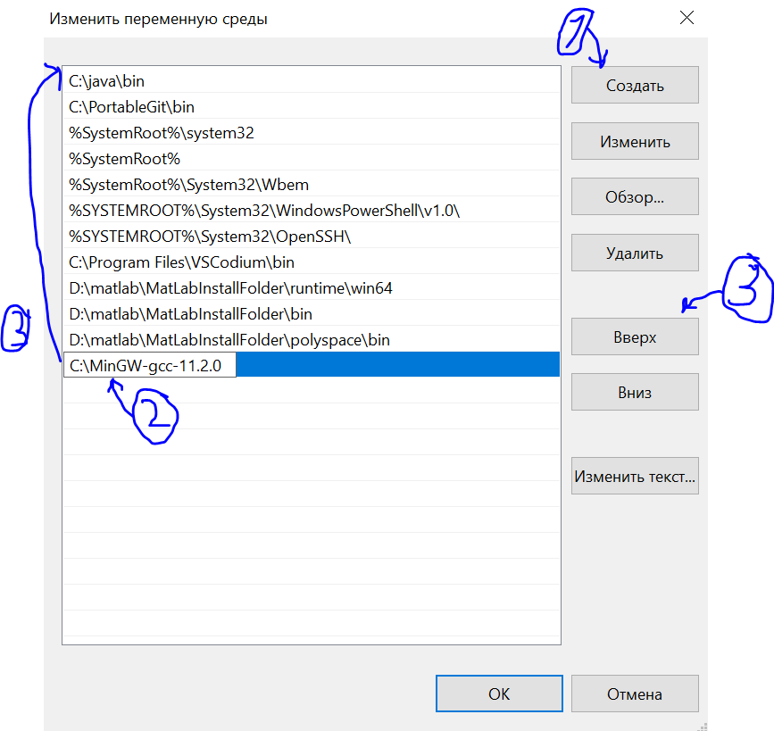
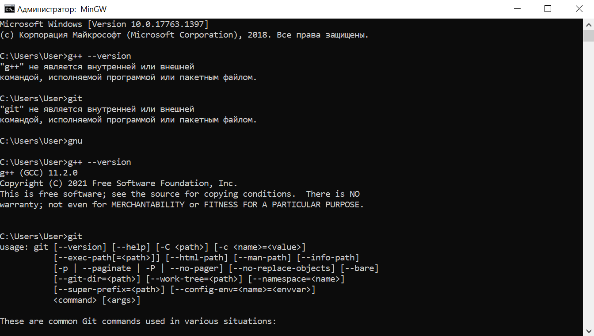
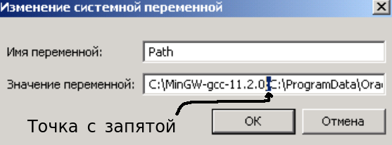

# Что это?

Есть 2 стула:

 - GCC (GNU Compiler Collection)

 - Microsoft Visual C++

~~(На самом деле, есть ещё стулья)~~

Они оба реализуют стандарты `C++`, но первое в рамках [GNU](https://ru.wikipedia.org/wiki/GNU_Compiler_Collection), а второе разработано [майками](https://ru.wikipedia.org/wiki/Microsoft_Visual_C%2B%2B).

[`MinGW`](https://ru.wikipedia.org/wiki/MinGW) — это "порт GCC" для Windows. Но в настоящее время с `MinGW` всё сложно, и поэтому появилось `MinGW-w64`.

[`MinGW-w64`](https://www.mingw-w64.org/) — это форк от `MinGW`, который предоставляет поддержку 64 бит и новые WinAPI. Но собрать себе `MinGW-w64` ещё та задача. Поэтому есть люди, которые собирают из исходников и делятся готовым решением. Например, можете посетить эти сайты:

 - [https://nuwen.net/mingw.html](https://nuwen.net/mingw.html)

 - [https://winlibs.com/](https://winlibs.com/)

# Как установить?

На сайтах выше есть инструкции, как это сделать. Но далее будет приведены ещё несколько.

## lite-версия

[Здесь](https://winlibs.com/) будут `gcc/g++ вместе с gdb` и `make`, и ещё некоторые утилиты.

Скачайте:
 - [`winlibs-x86_64-posix-seh-gcc-11.2.0-llvm-13.0.0-mingw-w64-9.0.0-r3.7z.001`](https://github.com/The220th/SharedLib/raw/main/cpp/Windows/MinGW/winlibs-x86_64-posix-seh-gcc-11.2.0-llvm-13.0.0-mingw-w64-9.0.0-r3.7z.001)

 - [`winlibs-x86_64-posix-seh-gcc-11.2.0-llvm-13.0.0-mingw-w64-9.0.0-r3.7z.002`](https://github.com/The220th/SharedLib/raw/main/cpp/Windows/MinGW/winlibs-x86_64-posix-seh-gcc-11.2.0-llvm-13.0.0-mingw-w64-9.0.0-r3.7z.002)

 - [`7z.dll`](https://github.com/The220th/SharedLib/raw/main/cpp/Windows/MinGW/7z.dll)
 
 - [`7z.exe`](https://github.com/The220th/SharedLib/raw/main/cpp/Windows/MinGW/7z.exe)

Переместите эти файлы в одну папку. Далее введите в этой папке команду:

``` bash
> 7z.exe x winlibs-x86_64-posix-seh-gcc-11.2.0-llvm-13.0.0-mingw-w64-9.0.0-r3.7z.001
```

После этого появится папка `7z.exe x winlibs-x86_64-posix-seh-gcc-11.2.0-llvm-13.0.0-mingw-w64-9.0.0-r3`, а в ней `mingw64`, которую вы можете переместить куда вам угодно. Например, в корень диска C:



В этой папке, есть папка `bin`. Нужно скопировать путь до этой папки, в данном случае `С:\mingw64\bin`.

Теперь нажмите `win+r` и введите:

``` bash
rundll32.exe sysdm.cpl,EditEnvironmentVariables
```



Внизу выберите `Path` -> `Изменить...`:



После этого добавьте путь до папки `bin`. В данном случае — это папка `С:\mingw64\bin`. Далее "поднимите наверх":



После это проверьте в терминале, что всё работает. Например, введите команду:

``` bash
> gcc --version
```

Если вы всё сделали правильно, то вывод должен быть примерно таким:




## MinGW на максималках

[Есть такая сборка](https://nuwen.net/mingw.html), где всё включено. Есть и `gcc/g++ вместе с gdb`, и `Boost`, и `libpng`, и `make`, и `git`, и ещё куча всего.

Скачайте:
 - [`MinGW-gcc-11.2.0.7z.001`](https://github.com/The220th/SharedLib/raw/main/cpp/Windows/MinGW/MinGW-gcc-11.2.0.7z.001)

 - [`MinGW-gcc-11.2.0.7z.002`](https://github.com/The220th/SharedLib/raw/main/cpp/Windows/MinGW/MinGW-gcc-11.2.0.7z.002)
 
 - [`7z.dll`](https://github.com/The220th/SharedLib/raw/main/cpp/Windows/MinGW/7z.dll)

 - [`7z.exe`](https://github.com/The220th/SharedLib/raw/main/cpp/Windows/MinGW/7z.exe)

Переместите эти файлы в одну папку. Далее введите в этой папке команду:

``` bash
> 7z.exe x MinGW-gcc-11.2.0.7z.001
```

После этого появится папка `MinGW-gcc-11.2.0`, которую вы можете переместить куда вам угодно. Например, в корень диска C:



Запомните путь до этой папки, в данном случае — это `С:\MinGW-gcc-11.2.0` (без папки `bin`). 

Теперь нажмите `win+r` и введите:

``` bash
rundll32.exe sysdm.cpl,EditEnvironmentVariables
```


Внизу выберите `Path` -> `Изменить...`:


После этого добавьте путь до папки `MinGW-gcc-11.2.0`. В данном случае — это папка `С:\MinGW-gcc-11.2.0`. Далее "поднимите наверх":



Теперь каждый раз открывая терминал прописывайте:

``` bash
> gnu
```



# Windows 7

Скриншоты были взяты для Windows 10. Для Windows 7 отличаться будет только последний шаг. Например, на Windows 10 это выглядит так:


А на Windows 7 будет выглядеть так:



Нужно добавить путь и отделить от остального точкой с запятой, потом нажать "ОК".
